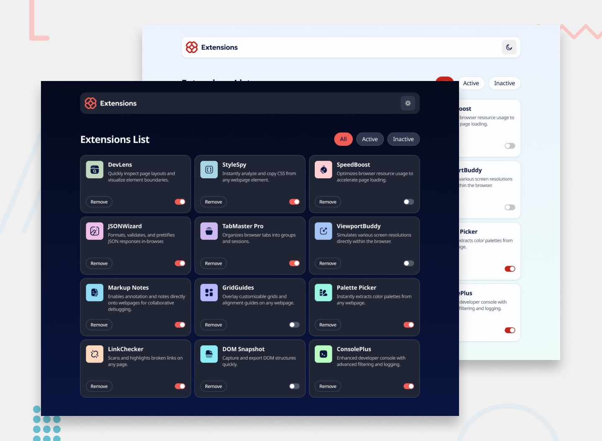

# Frontend Mentor - Browser extensions manager UI

## Welcome! 👋

# 🌐 Extensions Manager

A simple web application to manage browser-like extensions.  
Features include:  

- ✅ Displaying extensions data dynamically from API/mock data  
- 🌗 Dark/Light theme toggle (saved in LocalStorage)  
- 🗑️ Remove extension with smooth animation  
- 🔍 Filtering extensions (Active / Inactive / All)  
- 💾 LocalStorage support to keep theme preference  
- 📱 Fully responsive (Mobile → Tablet → Desktop)

---

## 🚀 Demo
[Live Preview](https://your-vercel-demo-link.com)

---

## 🛠️ Technologies Used
- HTML5
- CSS3 (Variables, Responsive design, Animations)
- JavaScript 
- LocalStorage
- API
   git clone https://github.com/your-username/extensions-manager.git

